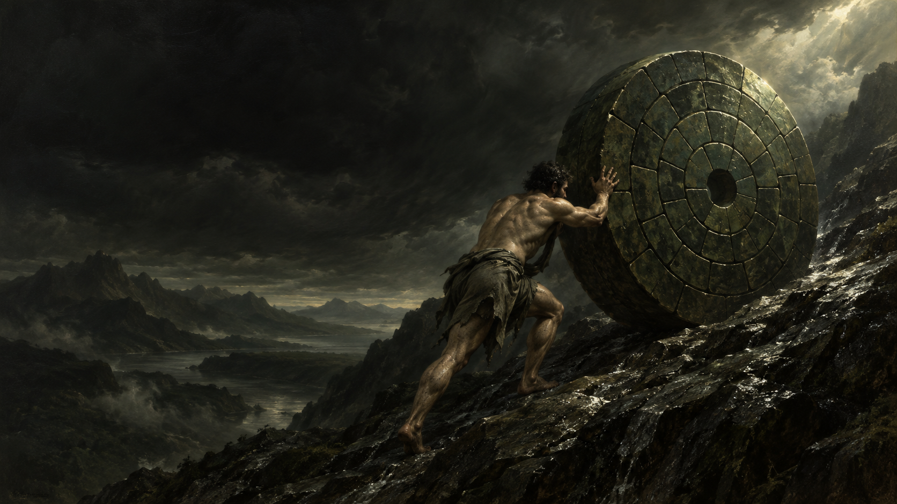

  

<h3 align="center">AI agents do the work. We make sure it is actually done.</h3>

  <a href="https://grit.grit-77.workers.dev/en"><b>Website</b></a> &nbsp;·&nbsp;
  <a href="https://grit.grit-77.workers.dev/en/radar"><b>RADAR</b></a> &nbsp;·&nbsp;
  <a href="https://grit.grit-77.workers.dev/en/early-access"><b>Early access</b></a> &nbsp;·&nbsp;
  <a href="https://x.com/gritradar_ai"><b>X</b></a> &nbsp;·&nbsp;
  <a href="https://www.instagram.com/gritradar.ai"><b>Instagram</b></a>

---

Hi, this is **Grit**, an AI company. We build with AI coding agents every day, and we
learned the hard way what they are bad at: they call work done before anyone
has checked it, they forget everything between sessions, and they will retry
forever on your quota. So we built the missing layer, and now we use it to
deliver work for companies and to ship our own product.

### RADAR

**RADAR** is that layer: a control plane for AI coding agents. It sits behind
Claude Code, Codex CLI, OMP and Hermes Agent and keeps one ledger under all of
them.

- **"Done" is a claim until the test passes again.** The acceptance test is
  written before the work and re-run on the result by someone other than the
  agent that did it.
- **One owner per task.** A lease and a fence token; a stale holder is refused.
- **Counted attempts.** Three worker attempts, then three takeovers. Switching
  model or machine does not reset the count.
- **Memory with a source.** Decisions and lessons are Markdown records with
  their evidence, searched offline and put in front of the next session.
- **Works with what you have.** Your existing Claude and ChatGPT
  subscriptions, or an API key you choose. Python 3.12+, no runtime
  dependencies, Windows and Linux; macOS is on the way.

The open edition will be free for individuals under **Apache-2.0**. RADAR is
in early access; its repository opens with the public release.
[Join the early-access list](https://grit.grit-77.workers.dev/en/early-access).

### For companies

We set up AI agents and RADAR for your team, write your rules and acceptance
tests with you, and deliver projects built this way — websites, internal
tools and automations, each with the evidence that it works.
[Write to us on X](https://x.com/gritradar_ai).

### Founders

**İsmet Aydın** — Founder & CEO &nbsp;·&nbsp; **Mustafa Toker** — Co-founder & COO

---

  Türkçe: Grit, şirketler ve bireyler için yapay zekâ çözümleri geliştirir. RADAR, kod yazan yapay zekâ ajanlarının işini kanıta bağlayan açık kaynak altyapımızdır. <a href="https://grit.grit-77.workers.dev/?tr">Türkçe site</a>

