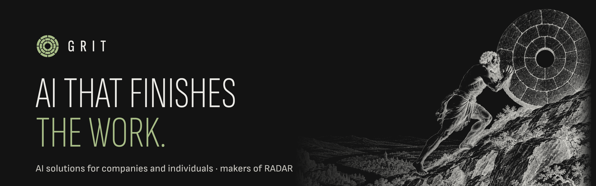

  

  <a href="https://grit.grit-77.workers.dev/en"><b>Website</b></a> &nbsp;·&nbsp;
  <a href="https://grit.grit-77.workers.dev/en/radar"><b>RADAR</b></a> &nbsp;·&nbsp;
  <a href="https://x.com/gritradar_ai"><b>X</b></a> &nbsp;·&nbsp;
  <a href="https://www.instagram.com/gritradar.ai"><b>Instagram</b></a>

**Grit** is an AI company for companies and individuals. We help teams set up AI agents, write the rules and the checks with them, and carry work through to a result someone can inspect. The rule behind everything we do: the work an AI does is measured, verified and written down.

## RADAR

**RADAR** is our agentic infrastructure: a control plane for AI coding agents. It puts one ledger under Claude Code, Codex CLI, OMP and Hermes Agent.

| Rule | What it means |
| :--- | :--- |
| **"Done" is a claim** | A task is refused as done until its acceptance test passes again on the current revision. The only way around it is an explicit manager override, and that is recorded too. |
| **One owner per task** | A lease and a fence token. A stale holder is refused. |
| **Counted attempts** | Three worker attempts, then three takeovers. After that the ledger refuses. |
| **Memory with a source** | Decisions and lessons are Markdown records with a source and a scope, searched offline through a local index and put in front of the agent before it acts. |
| **No new bill** | It runs on the Claude and ChatGPT subscriptions you already pay for; a paid API only if you name the provider and a budget. |
| **Small** | Python 3.12+, zero runtime dependencies. Runs on Windows and Linux; macOS is being brought to parity. |

**Editions.** The open edition is free for individuals and is released under **Apache-2.0**. A paid company edition is planned. RADAR is in early access and its repository opens at the public release. [Join the early-access list](https://grit.grit-77.workers.dev/en/early-access).

For companies: we also set up agents and RADAR on your team's machines and write your rules and acceptance tests with you. [Write to us on X](https://x.com/gritradar_ai).

---

  Grit · AI that finishes the work. Türkçe: şirketler ve bireyler için yapay zekâ çözümleri; RADAR, kod yazan yapay zekâ ajanları için açık kaynak ajan altyapısı. <a href="https://grit.grit-77.workers.dev/?tr">Türkçe site</a>

