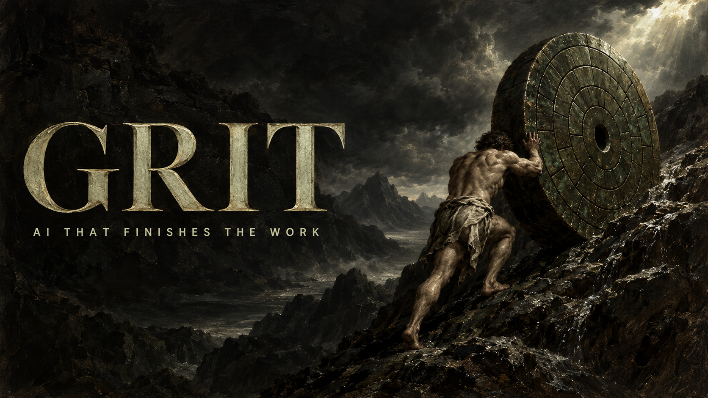

  

  <a href="https://grit.grit-77.workers.dev/en">Website</a> &nbsp;/&nbsp;
  <a href="https://grit.grit-77.workers.dev/en/radar">RADAR</a> &nbsp;/&nbsp;
  <a href="https://x.com/gritradar_ai">X</a> &nbsp;/&nbsp;
  <a href="https://www.instagram.com/gritradar.ai">Instagram</a> &nbsp;/&nbsp;
  <a href="https://grit.grit-77.workers.dev/en/early-access">Early access</a>

Hi, this is **Grit**, an AI company. We run fleets of AI coding agents every
day, and we build the layer that makes their work trustworthy: one owner per
task, counted attempts, and "done" only when the test passes again.

We use it to ship our own product and to deliver work for companies.

## Start here

<table>
  <tr>
    <td width="50%" valign="top">
      01 / THE PRODUCT
      <h3><a href="https://grit.grit-77.workers.dev/en/radar">RADAR</a></h3>
      A control plane for AI coding agents. One ledger behind Claude Code, Codex CLI, OMP and Hermes Agent.
        
      <a href="https://grit.grit-77.workers.dev/en/radar">See how it works →</a>
    </td>
    <td width="50%" valign="top">
      02 / EARLY ACCESS
      <h3><a href="https://grit.grit-77.workers.dev/en/early-access">Try it first</a></h3>
      The open edition will be free for individuals under Apache-2.0. Get it before the repository opens.
        
      <a href="https://grit.grit-77.workers.dev/en/early-access">Join the list →</a>
    </td>
  </tr>
  <tr>
    <td width="50%" valign="top">
      03 / FOR COMPANIES
      <h3><a href="https://x.com/gritradar_ai">Work with us</a></h3>
      We set up agents for your team, write the rules and acceptance tests with you, and deliver sites, tools and automations with proof that they work.
        
      <a href="https://x.com/gritradar_ai">Get in touch →</a>
    </td>
    <td width="50%" valign="top">
      04 / FOLLOW THE WORK
      <h3><a href="https://www.instagram.com/gritradar.ai">Behind the build</a></h3>
      News from the build: releases, experiments and what we learn running agents every day.
        
      <a href="https://www.instagram.com/gritradar.ai">Follow along →</a>
    </td>
  </tr>
</table>

## On the workbench: RADAR

AI agents are fast, and they sound certain. RADAR makes them accountable:

| Rule | What it means |
| :--- | :--- |
| **"Done" is a claim** | The acceptance test is written first and re-run on the result by someone other than the agent that did the work. |
| **One owner per task** | A lease and a fence token. A stale holder cannot write. |
| **Counted attempts** | Three worker attempts, then three takeovers. Switching model or machine does not reset the count. |
| **Memory with a source** | Decisions and lessons are Markdown records with their evidence, searched offline and put in front of the next session. |
| **Works with what you have** | Your existing Claude and ChatGPT subscriptions, or an API key you choose. Python 3.12+, no runtime dependencies, Windows and Linux; macOS is on the way. |

In active development. The repository opens with the public release.

## Founders

**İsmet Aydın** — Founder & CEO &nbsp;·&nbsp; **Mustafa Toker** — Co-founder & COO

---

  <b>Build. Verify. Ship.</b> 
  Türkçe: Grit, şirketler ve bireyler için yapay zekâ çözümleri geliştirir. RADAR, kod yazan yapay zekâ ajanlarının işini kanıta bağlayan açık kaynak altyapımızdır. <a href="https://grit.grit-77.workers.dev/?tr">Türkçe site</a>

