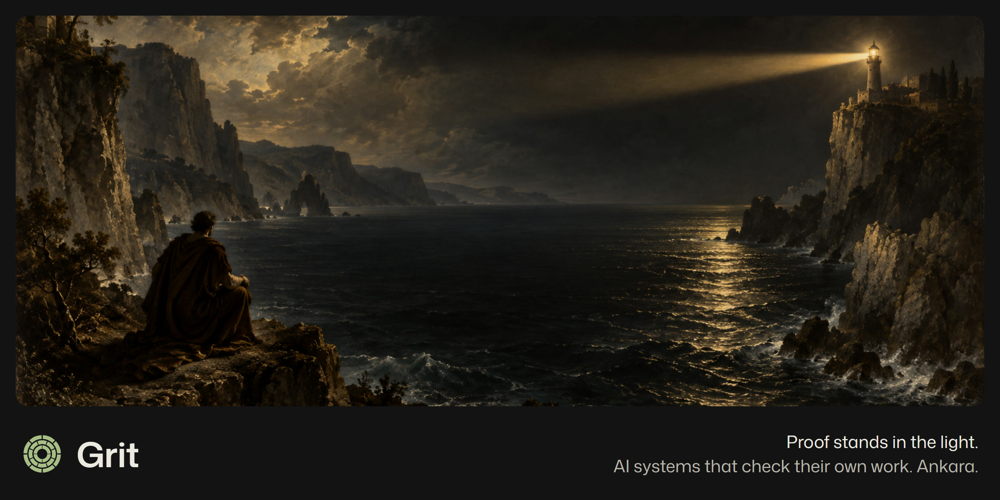
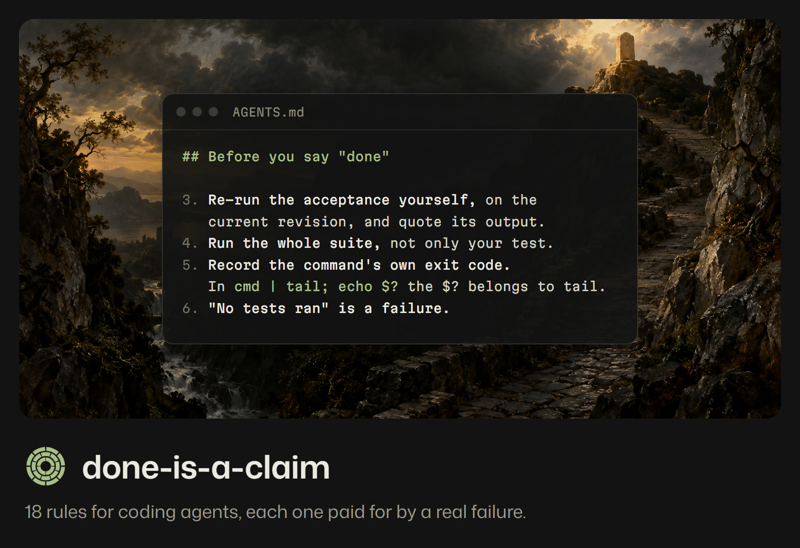
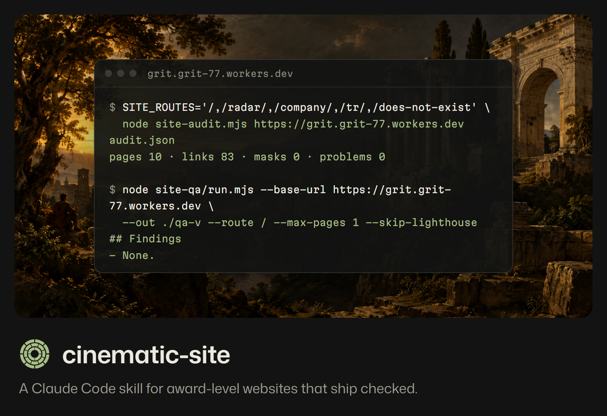
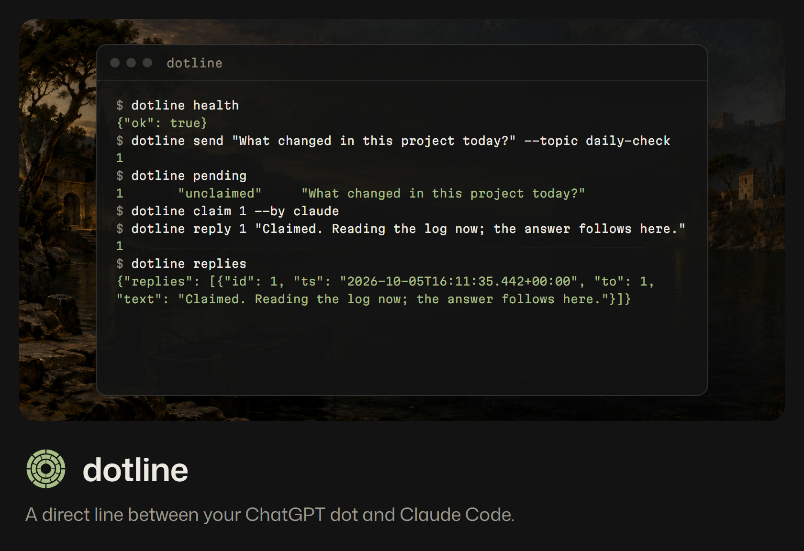
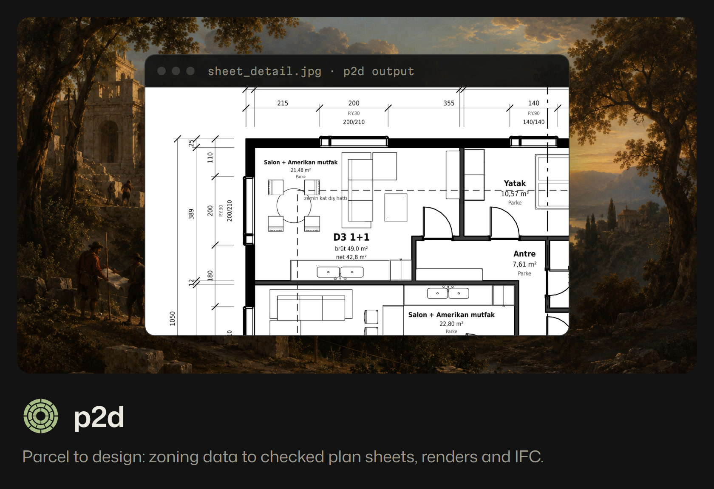
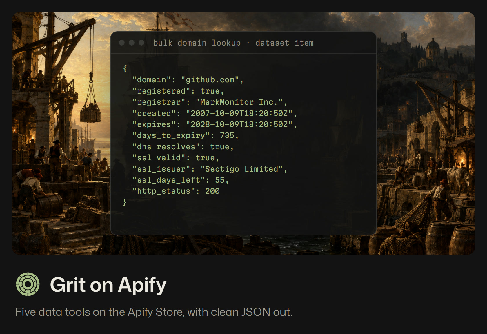

  <a href="https://grit.grit-77.workers.dev/"><b>Website</b></a> &nbsp;·&nbsp;
  <a href="https://grit.grit-77.workers.dev/radar/"><b>RADAR</b></a> &nbsp;·&nbsp;
  <a href="https://x.com/gritradar_ai"><b>X</b></a> &nbsp;·&nbsp;
  <a href="https://www.instagram.com/gritradar.ai/"><b>Instagram</b></a> &nbsp;·&nbsp;
  <a href="https://grit.grit-77.workers.dev/contact/"><b>Contact</b></a>

We are **Grit**, an AI company in Ankara. We run AI coding agents every day and build the layer that makes their work count: **a task is done only when its own acceptance test runs again and passes**, run by the system, not by the agent that did the work.

## Open source

<table>
  <tr>
    <td width="50%" valign="top">
      
      
<a href="https://github.com/Grit-77/done-is-a-claim"><b>done-is-a-claim</b></a> · drop-in AGENTS.md / CLAUDE.md, every rule with the incident behind it, plus three skills.

    </td>
    <td width="50%" valign="top">
      
      
<a href="https://github.com/Grit-77/cinematic-site"><b>cinematic-site</b></a> · a Claude Code skill with a browser QA pass and a layout audit at phone and desktop width.

    </td>
  </tr>
  <tr>
    <td width="50%" valign="top">
      
      
<a href="https://github.com/Grit-77/dotline"><b>dotline</b></a> · a tiny HTTPS mailbox: the dot sends, Claude Code claims and replies. Standard library only.

    </td>
    <td width="50%" valign="top">
      
      
<a href="https://github.com/Grit-77/p2d"><b>p2d</b></a> · İmar verisinden mimari projeye: A3 sheets, renders, a client PDF and IFC, FreeCAD and DXF files.

    </td>
  </tr>
  <tr>
    <td colspan="2" align="center">
      
      
<a href="https://github.com/Grit-77/apify-actors"><b>Grit on Apify</b></a> · website screenshots and PDFs, app reviews, domain lookup, ATS jobs and Polymarket odds.

    </td>
  </tr>
</table>

## On the workbench: RADAR

**Many agents, one gate.** RADAR runs your AI coding agents, Claude Code, Codex, OMP and Hermes, against one ledger. The acceptance command is written before the work starts. When an agent says it is done, RADAR runs that command itself on the current revision, and the task closes only if it passes.

| Rule | What it means |
| :--- | :--- |
| **"Done" is a claim** | `radar task done` is refused until RADAR's own run of the acceptance command has passed. |
| **One owner per task** | A lease and a fence token. A write from a stale owner is refused. |
| **Counted attempts** | Three worker attempts, then three takeovers. Then the task waits for a person. |
| **Memory with a source** | Decisions and lessons are Markdown records with a source and a scope, searched offline. |
| **Nothing new to run** | Python 3.12+, no runtime dependencies, no account. Windows and Linux; macOS is not supported yet. |

**In early access.** [How it works](https://grit.grit-77.workers.dev/radar/how-it-works/) · [Ask for early access](https://grit.grit-77.workers.dev/contact/?topic=radar)

## How we work

- **The test comes first.** Every task starts with the command that will prove it.
- **Done is a claim.** The system reruns the proof; the agent's word is not enough.
- **Built in the open where it helps.** Tools we use every day, released when they are ready.

**Co-founders:** İsmet Aydın &nbsp;·&nbsp; Mustafa Toker &nbsp;·&nbsp; Ali Baha Berkal

 

   
  <b>Test first. Verify again. Close with proof.</b> 
  Türkçe: Grit, şirketler ve bireyler için yapay zekâ sistemleri kurar. RADAR, kod yazan yapay zekâ ajanlarının işini kanıta bağlar: bir görev, kabul testi yeniden çalışıp geçmeden bitmiş sayılmaz. <a href="https://grit.grit-77.workers.dev/tr/">Türkçe site</a>

