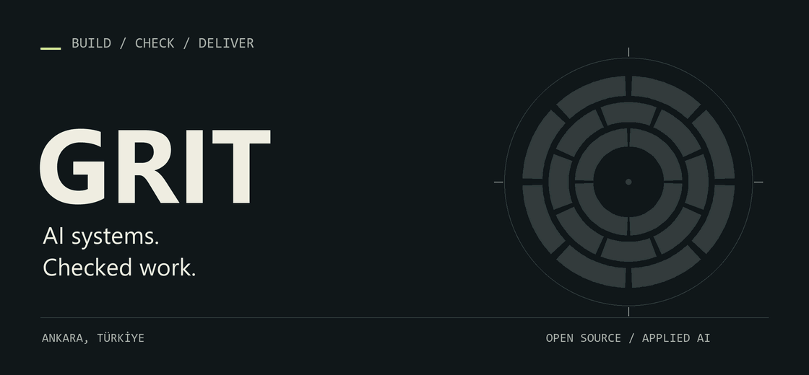

<picture>
  <source media="(prefers-reduced-motion: reduce)" srcset="assets/profile/grit-cover.png">
  
</picture>

[Static cover](assets/profile/grit-cover.png) · [Replay animation](assets/profile/grit-intro.gif)

# İsmet Aydın

**Founder of Grit · Ankara, Türkiye**

I build practical AI tools, agent workflows, and open-source software. The thread through my work is simple: make useful things, check the result, and keep the evidence close.

[Grit website](https://grit.grit-77.workers.dev/) · [Get in touch](https://grit.grit-77.workers.dev/contact/)

## Selected work

### [done-is-a-claim](https://github.com/Grit-77/done-is-a-claim)

**Your agent says “done”. What would prove it?**

Incident-backed rules and focused skills for coding agents, with local tools for capturing and rechecking evidence. Start with a Markdown rules file; add the workflows you need.

[Read the rules](https://github.com/Grit-77/done-is-a-claim/blob/main/AGENTS.md) · [Try the demo](https://github.com/Grit-77/done-is-a-claim#watch-a-false-green)

### [dotline](https://github.com/Grit-77/dotline)

**A small mailbox between your ChatGPT dot and Claude Code.**

Send a request, claim the work, and read the reply through ordinary HTTPS. Python standard library, with no model API calls. The coding session does the work; you decide what it may authorize.

[How it works](https://github.com/Grit-77/dotline#quickstart-three-steps) · [Trust and security](https://github.com/Grit-77/dotline#trust-and-security)

## In development

**Remember, Dammit.** — shared memory for AI coding agents, designed to carry project decisions across tools and sessions. Currently in development.

## More from Grit

- [**p2d**](https://github.com/Grit-77/p2d) — zoning data to architectural concept plans, sheets, renders, and editable CAD files. Architect review required.
- [**cinematic-site**](https://github.com/Grit-77/cinematic-site) — a set of agent skills for taking a website from brief through design, accessibility, and release checks.
- [**apify-actors**](https://github.com/Grit-77/apify-actors) — data tools for website capture, app reviews, domains, jobs, and market odds.

---

**Useful tools. Inspectable work.**

Have a concrete problem to build around? [Let's talk](https://grit.grit-77.workers.dev/contact/). Türkçe de yazabilirsiniz.
