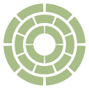

<!--
  Grit-77/Grit-77/README.md: the GitHub profile README (v4, rewritten 2026-09-30).
  Staged for the manager, who publishes it. Every claim is sourced from the live site
  (grit.grit-77.workers.dev) or the Grit repository's README.md and oss/README.md.
  The images sit next to this file: the disk mark is a byte copy of docs/brand/grit-disk-mark-green.svg,
  and radar-verification.png is a byte copy of the RADAR README hero (oss/readme/hero.png).
-->

  

<h1 align="center">Grit</h1>

<b>Proof stands in the light.</b> An AI company that checks its own work.

  <a href="https://grit.grit-77.workers.dev/">Website</a> &nbsp;·&nbsp;
  <a href="https://grit.grit-77.workers.dev/radar/">RADAR</a> &nbsp;·&nbsp;
  <a href="https://grit.grit-77.workers.dev/company/">Company</a> &nbsp;·&nbsp;
  <a href="https://grit.grit-77.workers.dev/contact/">Contact</a> &nbsp;·&nbsp;
  <a href="https://x.com/gritradar_ai">X</a> &nbsp;·&nbsp;
  <a href="https://www.instagram.com/gritradar.ai/">Instagram</a>

Grit builds AI systems for companies and individuals. We run AI coding agents every day, and we built the layer that makes their work count: a task is done only when its own acceptance test runs again and passes, run by the system and not by the agent that did the work.

## RADAR: agents say done, RADAR checks

RADAR is our product. It keeps one ledger for AI coding agents such as Claude Code, Codex, OMP and Hermes, and it closes a task only when the task's acceptance command passes again on the current revision.

| Rule | What it means |
| :--- | :--- |
| **"Done" is a claim** | The acceptance command is written before the work starts, and RADAR runs it itself. `radar task done` is refused until that run has passed. |
| **One owner per task** | A lease and a fence token. A write from a stale owner is refused. |
| **Counted attempts** | Three worker attempts, then three takeovers. Then the task waits for a person. |
| **Memory with a source** | Decisions and lessons are Markdown records with a source and a scope, searched offline. |
| **Nothing new to run** | Python 3.12+, no runtime dependencies, no account. Linux, macOS and Windows. |

RADAR is in early access and its repository is private for now. [Ask for early access](https://grit.grit-77.workers.dev/contact/?topic=radar), or read [how it works](https://grit.grit-77.workers.dev/radar/how-it-works/).

## Work with us

We set up AI agents for teams, write the rules and the acceptance tests with them, and deliver websites, tools and automations with proof that they work. [Tell us about the work](https://grit.grit-77.workers.dev/contact/).

## Co-founders

İsmet Aydın &nbsp;·&nbsp; Mustafa Toker &nbsp;·&nbsp; Ali Baha Berkal

---

  Türkçe: Grit, şirketler ve bireyler için yapay zekâ sistemleri kurar. RADAR, kod yazan yapay zekâ ajanlarının işini kanıta bağlar: bir görev, kabul testi yeniden çalışıp geçmeden bitmiş sayılmaz. <a href="https://grit.grit-77.workers.dev/tr/">Türkçe site</a>

