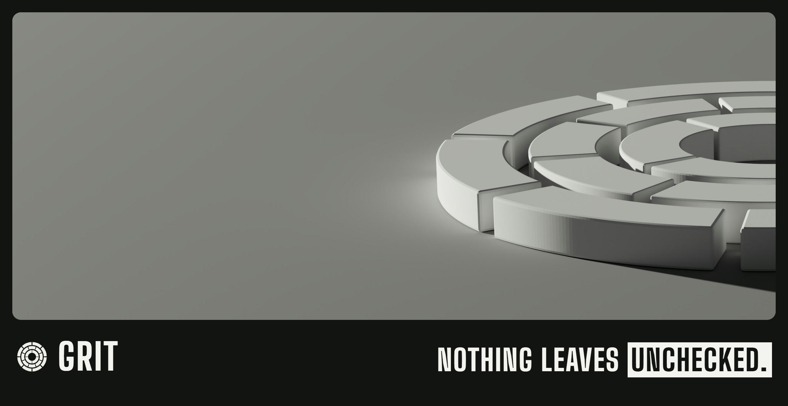
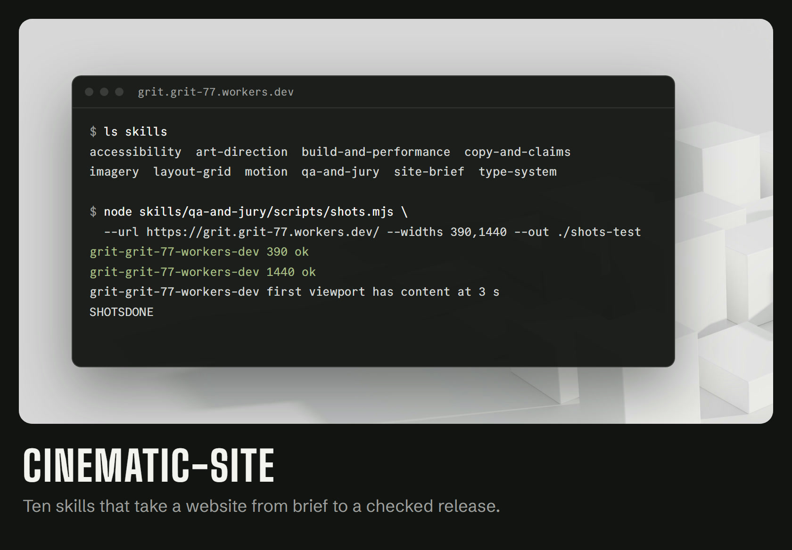
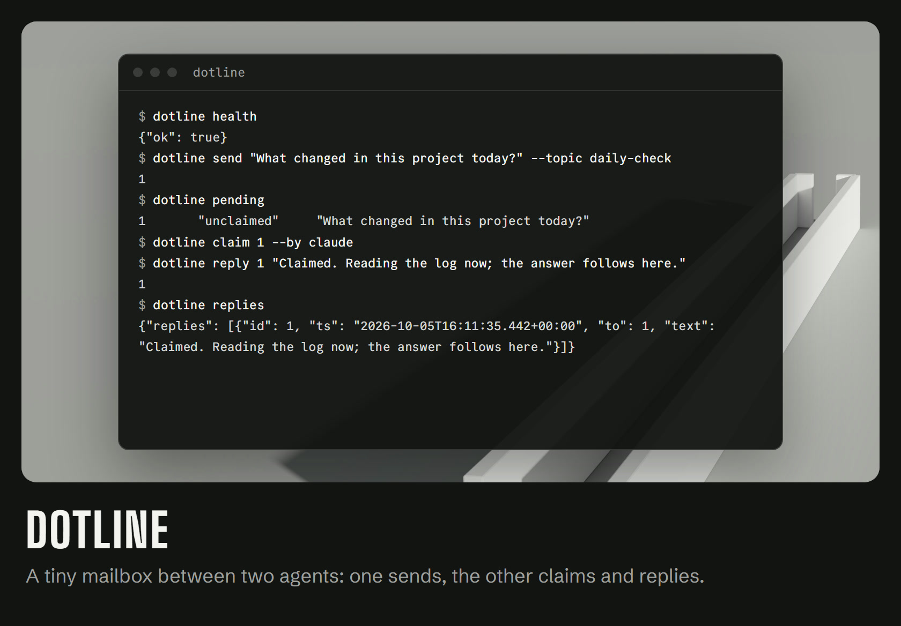
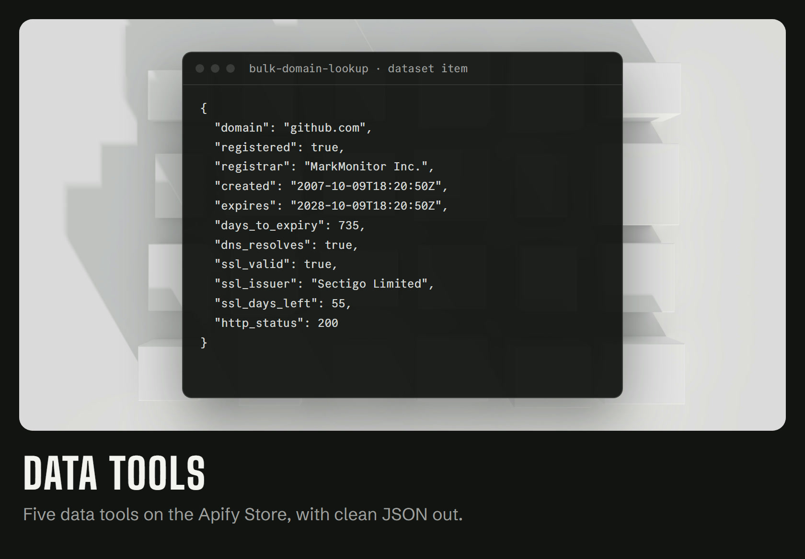
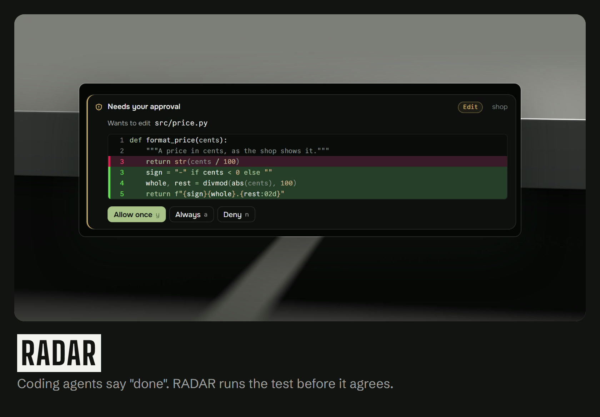
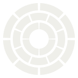

  <a href="https://grit.grit-77.workers.dev/"><b>Website</b></a> &nbsp;·&nbsp;
  <a href="https://grit.grit-77.workers.dev/radar/"><b>RADAR</b></a> &nbsp;·&nbsp;
  <a href="https://x.com/gritradar_ai"><b>X</b></a> &nbsp;·&nbsp;
  <a href="https://www.instagram.com/gritradar.ai/"><b>Instagram</b></a> &nbsp;·&nbsp;
  <a href="https://grit.grit-77.workers.dev/contact/"><b>Contact</b></a>

Grit is an AI company in Ankara that checks its own work. Our mark is a labyrinth: three rings, twenty tiles, and no straight line from the centre to the outside. Work leaves only through the checks.

## Open source

<table>
  <tr>
    <td width="50%" valign="top">
      
      
<a href="https://github.com/Grit-77/done-is-a-claim"><b>done-is-a-claim</b></a> · a drop-in AGENTS.md / CLAUDE.md, each rule with the incident behind it, plus three skills.

    </td>
    <td width="50%" valign="top">
      
      
<a href="https://github.com/Grit-77/cinematic-site"><b>cinematic-site</b></a> · a skill with a browser QA pass and a layout audit at phone and desktop width.

    </td>
  </tr>
  <tr>
    <td width="50%" valign="top">
      
      
<a href="https://github.com/Grit-77/dotline"><b>dotline</b></a> · a tiny HTTPS mailbox between a ChatGPT dot and Claude Code. Standard library only.

    </td>
    <td width="50%" valign="top">
      
      
<a href="https://github.com/Grit-77/apify-actors"><b>Data tools</b></a> · website screenshots and PDFs, app reviews, domain lookup, ATS jobs and Polymarket odds on the Apify Store.

    </td>
  </tr>
</table>

## RADAR

**Many agents, one gate.** RADAR runs your AI coding agents against one ledger. The acceptance command is written before the work starts. When an agent says it is done, RADAR runs that command itself on the current revision, and the task closes only if it passes.

| Rule | What it means |
| :--- | :--- |
| **"Done" is a claim** | `radar task done` is refused until RADAR's own run of the acceptance command has passed. |
| **One owner per task** | A lease and a fence token. A write from a stale owner is refused. |
| **Counted attempts** | Three worker attempts, then three takeovers. Then the task waits for a person. |
| **Memory with a source** | Decisions and lessons are Markdown records with a source and a scope, searched offline. |

[How it works](https://grit.grit-77.workers.dev/radar/how-it-works/) · [Ask for early access](https://grit.grit-77.workers.dev/contact/?topic=radar)

## How we work

- **The test comes first.** Every task starts with the command that will prove it.
- **Done is a claim.** The system reruns the proof; the agent's word is not enough.
- **Built in the open where it helps.** Tools we use every day, released when they are ready.

**Co-founders:** İsmet Aydın &nbsp;·&nbsp; Mustafa Toker &nbsp;·&nbsp; Ali Baha Erkal

 

   
  <b>Nothing leaves unchecked.</b> 
  Hiçbir şey kontrolsüz çıkmaz. Grit, şirketler ve bireyler için yapay zekâ sistemleri kurar ve her işi kontrol ederek teslim eder. <a href="https://grit.grit-77.workers.dev/tr/">Türkçe site</a>

