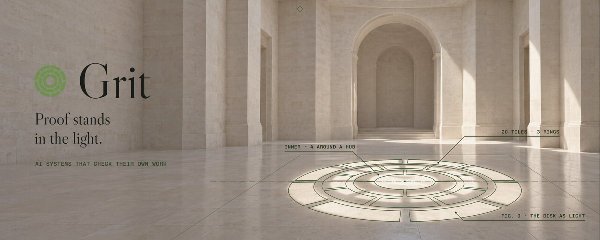
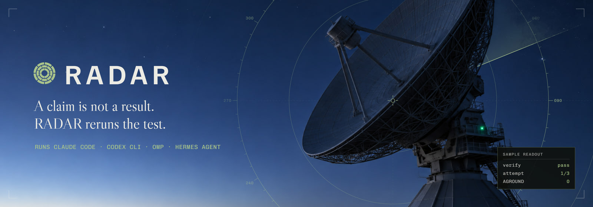
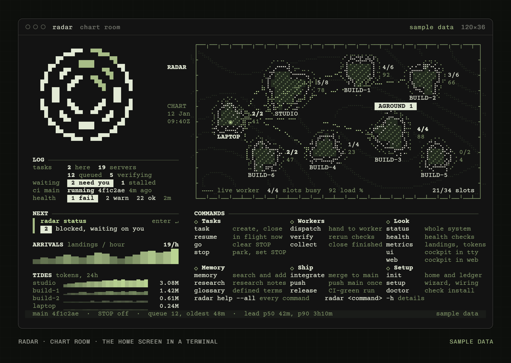

  

  <a href="https://grit.grit-77.workers.dev">Website</a> ·
  <a href="https://grit.grit-77.workers.dev/radar/">RADAR</a> ·
  <a href="https://grit.grit-77.workers.dev/radar/how-it-works/">How RADAR works</a> ·
  <a href="https://grit.grit-77.workers.dev/company/">Company</a> ·
  <a href="https://grit.grit-77.workers.dev/contact/">Contact</a>

**Grit builds AI systems that check their own work.** An AI agent that says *done* has made a claim; everything we build closes on a check that runs again, not on the claim. Our product is RADAR. For companies and individuals we also build websites, AI automations and autonomous systems, and bring scattered data into one place.

## RADAR

  

RADAR runs the AI coding agents you already use (Claude Code, Codex CLI, OMP and Hermes Agent) and closes a task only after it reruns the acceptance test itself. It grew out of the infrastructure we use for our own work.

The test is written first → an agent works in its own copy of the project → it says *done*, recorded as a claim → RADAR reruns the test → it passes: the task closes and the proof is kept · it fails: the task reopens with the failure attached.

  

The chart room, RADAR's home screen in a terminal, with sample data.

> In Grit's own work (20-28 Sep 2026), workers running one coding agent reported a task as finished 1,608 times (1,457 tasks); Grit's immediate re-run of the acceptance commands on the same server failed on 74 of those reports (4.6%). A claim alone does not close a task.
>
> Grit internal ledger, snapshot 28 Sep 2026 06:00 UTC. Observed, not a controlled comparison.

[The website draws the figure, one square per report.](https://grit.grit-77.workers.dev/radar/#benchmark)

- **For individuals:** an open edition, open source (Apache-2.0) at public release. In early access now: [ask for a place.](https://grit.grit-77.workers.dev/contact/?topic=radar)
- **For companies:** a company edition, in development. [Talk to us.](https://grit.grit-77.workers.dev/contact/?topic=radar-company)

## What we do

- **Websites**, designed and built with you from the first draft to the live site: accessible, quick to load, in your visitors' languages.
- **AI automations**: repetitive work done the same way each time, every result checked before it is used.
- **Autonomous systems**: agents that carry a piece of work from start to finish; a task closes only when its test passes again.
- **Data**: scattered data brought into one place and cleaned, reliable enough to decide on.

## Write to us

[radarbygrit@gmail.com](mailto:radarbygrit@gmail.com) · [X @gritradar_ai](https://x.com/gritradar_ai) · [Instagram @gritradar.ai](https://www.instagram.com/gritradar.ai/)

Grit · Ankara · founded June 2026 · <a href="https://grit.grit-77.workers.dev">grit.grit-77.workers.dev</a>
