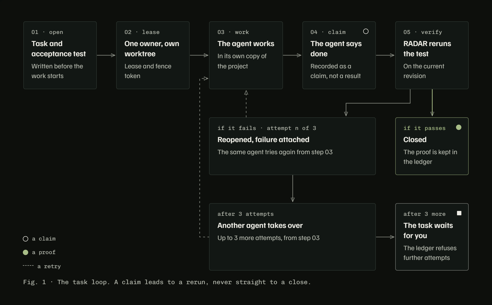

  

  <a href="https://grit.grit-77.workers.dev">Website</a> ·
  <a href="https://grit.grit-77.workers.dev/radar/">RADAR</a> ·
  <a href="https://grit.grit-77.workers.dev/radar/how-it-works/">How RADAR works</a> ·
  <a href="https://grit.grit-77.workers.dev/company/">Company</a> ·
  <a href="https://grit.grit-77.workers.dev/contact/">Contact</a>

**Grit builds AI systems that check their own work.** We connect a company's data, automate its work, and run it with systems that check their own results. Founded in Ankara in June 2026.

An AI agent that says *done* has made a claim. Everything we build is closed by a check that runs again, not by the claim.

## What we do

- **Websites.** Designed and built with you, from the first draft to the live site: accessible, quick to load, and in the languages your visitors read. For companies and individuals.
- **AI automations.** Repetitive work handled by AI, the same steps done the same way each time. Every result is checked before it is used.
- **Autonomous systems.** Agents that carry a piece of work from start to finish, built the way RADAR works: a task closes only when its test passes again.
- **Data.** Scattered data brought together in one place and cleaned, so it is reliable enough to work with and to decide on.

## RADAR

  

RADAR is our product. It runs the AI coding agents you already use (Claude Code, Codex CLI, OMP and Hermes Agent) and closes a task only after it reruns the acceptance test itself.

  

> In Grit's own work (20-28 Sep 2026), workers running one coding agent reported a task as finished 1,608 times (1,457 tasks); Grit's immediate re-run of the acceptance commands on the same server failed on 74 of those reports (4.6%). A claim alone does not close a task.
>
> Grit internal ledger, snapshot 28 Sep 2026 06:00 UTC. Observed, not a controlled comparison.

- **For individuals:** an open edition, open source (Apache-2.0) at public release. [Early access is open now.](https://grit.grit-77.workers.dev/contact/?topic=radar)
- **For companies:** a company edition, in development. [Talk to us.](https://grit.grit-77.workers.dev/contact/?topic=radar-company)

## Write to us

[radarbygrit@gmail.com](mailto:radarbygrit@gmail.com) · [X @gritradar_ai](https://x.com/gritradar_ai) · [Instagram @gritradar.ai](https://www.instagram.com/gritradar.ai/)

Grit · Ankara · The website reads in 24 languages.
