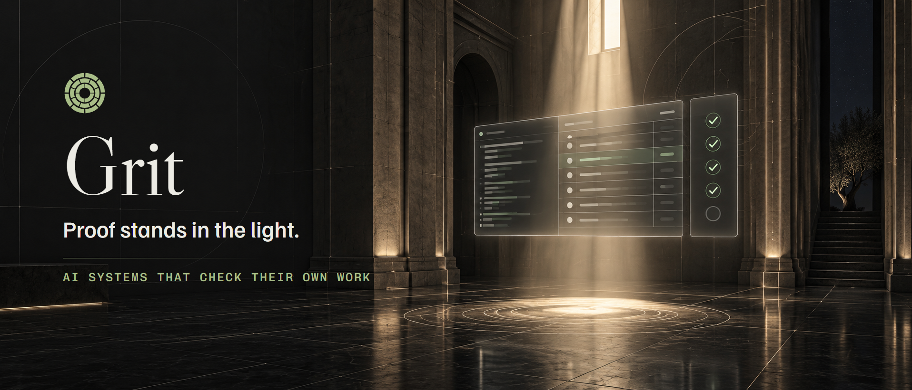
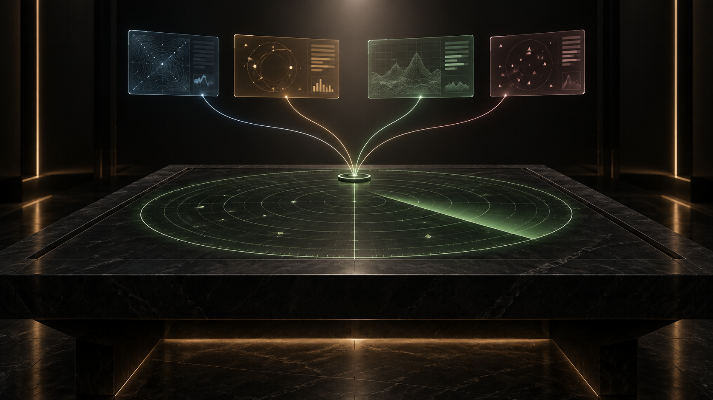
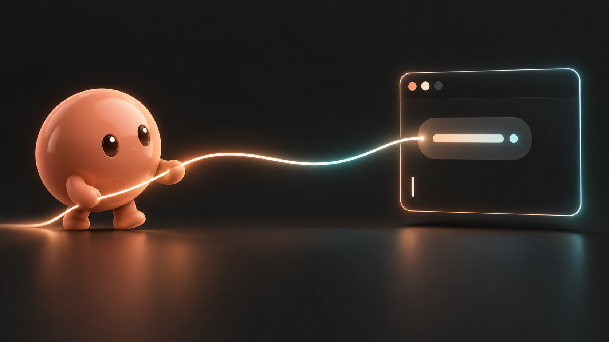
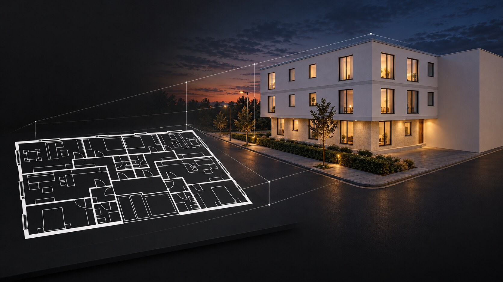
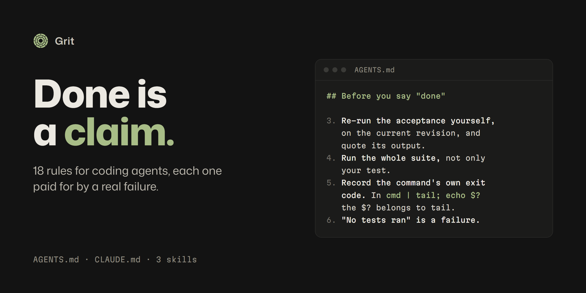
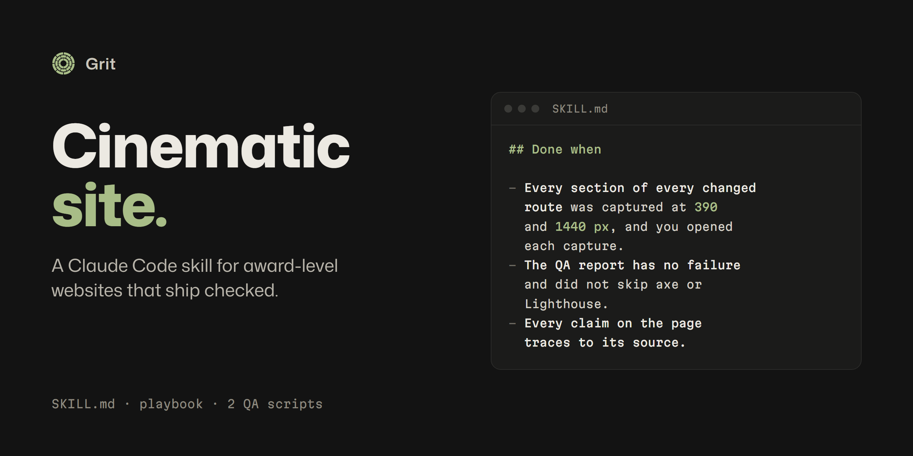

  

  <a href="https://grit.grit-77.workers.dev/"><b>Website</b></a> &nbsp; / &nbsp;
  <a href="https://grit.grit-77.workers.dev/radar/"><b>RADAR</b></a> &nbsp; / &nbsp;
  <a href="https://x.com/gritradar_ai"><b>X</b></a> &nbsp; / &nbsp;
  <a href="https://www.instagram.com/gritradar.ai/"><b>Instagram</b></a> &nbsp; / &nbsp;
  <a href="https://grit.grit-77.workers.dev/contact/"><b>Get in touch</b></a>

 

We are **Grit**, an AI company in Ankara. We run AI coding agents every day, and we build the layer that makes their work count: **a task is done only when its own acceptance test runs again and passes**, run by the system and not by the agent that did the work.

Here you can use the tools we open-source, follow RADAR on its way out, and see how we work.

## Start here

<table>
  <tr>
    <td width="50%" valign="top">
      01 / PRODUCT
      <h3><a href="https://grit.grit-77.workers.dev/radar/">RADAR</a></h3>
      
Agents say done. RADAR checks. One ledger for your AI coding agents that closes a task only after its acceptance test passes again.

      
<a href="https://grit.grit-77.workers.dev/contact/?topic=radar"><b>Ask for early access →</b></a>

    </td>
    <td width="50%" valign="top">
      02 / OPEN SOURCE
      <h3><a href="https://github.com/Grit-77/dotline">dotline</a></h3>
      
A direct line between your ChatGPT dot and Claude Code: a tiny HTTPS mailbox where the dot sends, Claude claims and answers.

      
<a href="https://github.com/Grit-77/dotline"><b>Open a line →</b></a>

    </td>
  </tr>
  <tr>
    <td width="50%" valign="top">
      03 / OPEN SOURCE
      <h3><a href="https://github.com/Grit-77/p2d">p2d</a></h3>
      
Parcel to design: from zoning data to a checked plan, A3 vector sheets, photoreal renders and the architect's IFC, FreeCAD and DXF files, all from one model.

      
<a href="https://github.com/Grit-77/p2d"><b>See the sheets →</b></a>

    </td>
    <td width="50%" valign="top">
      04 / WORK WITH US
      <h3><a href="https://grit.grit-77.workers.dev/contact/">Grit for teams</a></h3>
      
We set up AI agents for teams, write the rules and the acceptance tests with them, and deliver websites, tools and automations with proof that they work.

      
<a href="https://grit.grit-77.workers.dev/contact/"><b>Tell us about the work →</b></a>

    </td>
  </tr>
</table>

## On the workbench: RADAR

  

**Many agents, one gate.** RADAR runs your AI coding agents, Claude Code, Codex, OMP and Hermes, against one ledger. The acceptance command is written before the work starts. When an agent says it is done, RADAR runs that command itself on the current revision, and the task closes only if it passes.

| Rule | What it means |
| :--- | :--- |
| **"Done" is a claim** | `radar task done` is refused until RADAR's own run of the acceptance command has passed. |
| **One owner per task** | A lease and a fence token. A write from a stale owner is refused. |
| **Counted attempts** | Three worker attempts, then three takeovers. Then the task waits for a person. |
| **Memory with a source** | Decisions and lessons are Markdown records with a source and a scope, searched offline. |
| **Nothing new to run** | Python 3.12+, no runtime dependencies, no account. Windows and Linux; macOS is not supported yet. |

**In early access.** The repository is private for now. [How it works](https://grit.grit-77.workers.dev/radar/how-it-works/) · [Ask for early access](https://grit.grit-77.workers.dev/contact/?topic=radar)

## Open source

<table>
  <tr>
    <td width="50%" valign="top">
      
      <h3><a href="https://github.com/Grit-77/dotline">dotline</a></h3>
      
Your dot notices something while you are away; Claude Code works on it in the session you already have open. Claim and reply, a Monitor hook or a native channel.

      Python 3.10+ · standard library only · Apache-2.0
    </td>
    <td width="50%" valign="top">
      
      <h3><a href="https://github.com/Grit-77/p2d">p2d</a></h3>
      
İmar verisinden mimari projeye. A regulation-checked plan becomes architect-grade sheets, a furnished 3D model, renders and a client PDF.

      Python · IFC · FreeCAD · DXF · Apache-2.0
    </td>
  </tr>
  <tr>
    <td width="50%" valign="top">
      
      <h3><a href="https://github.com/Grit-77/done-is-a-claim">done-is-a-claim</a></h3>
      
18 rules for coding agents, each with the failure behind it, in one drop-in AGENTS.md / CLAUDE.md. Plus three skills: reading-measurements, whose-red, public-claims.

      Markdown · Claude Code · Codex · Apache-2.0
    </td>
    <td width="50%" valign="top">
      
      <h3><a href="https://github.com/Grit-77/cinematic-site">cinematic-site</a></h3>
      
A Claude Code skill for award-level websites that ship checked: one story, every claim sourced, a browser QA pass and a layout audit at phone and desktop width.

      Claude Code skill · Playwright · axe · Lighthouse · Apache-2.0
    </td>
  </tr>
</table>

On the Apify Store: [five data tools](https://github.com/Grit-77/apify-actors) for website screenshots and PDFs, app reviews, bulk domain lookup, ATS job postings and Polymarket odds.

## How we work

- **The test comes first.** Every task starts with the command that will prove it.
- **Done is a claim.** The system reruns the proof; the agent's word is not enough.
- **Built in the open where it helps.** Tools we use every day, released when they are ready.

## Connect

**Co-founders:** İsmet Aydın &nbsp;·&nbsp; Mustafa Toker &nbsp;·&nbsp; Ali Baha Berkal

 

---

   
  <b>Test first. Verify again. Close with proof.</b> 
  Türkçe: Grit, şirketler ve bireyler için yapay zekâ sistemleri kurar. RADAR, kod yazan yapay zekâ ajanlarının işini kanıta bağlar: bir görev, kabul testi yeniden çalışıp geçmeden bitmiş sayılmaz. <a href="https://grit.grit-77.workers.dev/tr/">Türkçe site</a>

